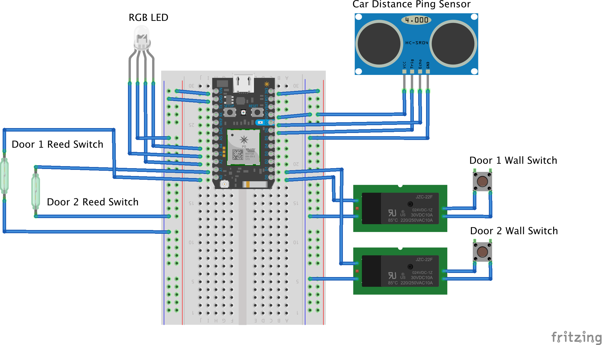

# GarageOS: Building a Smart Garage

A few months ago, the garage door opener motor at my house failed. I don't blame it -- after decades of dutifully opening and closing its 160 lb door on command, perhaps it was time for a rest. Also this old garage door opener didn't have the benifits of modern technology, like secure radio codes, advanced drive systems and of course, internet connectivity.

Walking through the aisle of a suburban Home Depot, I was amazed to see how many of the garage door openers sold there provided some sort of app to control and get notifications about the door. Those features seem cool, but besides a hefty $200 price premium, I don't just want a smart garage door opener, I want a complete smart garage. So, I bought the cheapest opener for $60 bucks and set off to build a smart garage myself: GarageOS.

## Scope it out
Given my [background](http://dwcares.com/2013/08/19/slide-deck-framing/), for most projects that I take on, even the fun ones, I go through a quick process of planning. Really, what's the pain that I'm trying to solve, to make my life better...not just add technology for technology sake (even though there's some of that too).

### Problems worth solving
1. When I'm heading out on a walk or a bike ride, I always go out the garage since that's the best way to get to town, and it's where all the wagons, strollers and bikes are stored. This means brining a garage door remote on every walk, if I forget it, I'm essentially locked out. I wish I always had a garage door remote with me.
2. When I'm halfway across the country on a vacation, I always have that pit in my stomach -- did I leave the garage door open? I wish I could just know, even if I'm in a different time zone.
3. When I pull into the garage with the car, space is at a premium. If I don't pull to close enough, the garage door won't close or I won't be able to get the trunk open, if I pull to close, I wont be able to walk pass the car. I wish I could just know the sweet spot of when I'm parked correctly.
4. When I'm at work, it would be great if I knew my wife's car was home yet, or if she's still on her way.

### Most important to me
Given these problems, let's decide on a few capabilities worth building in our GarageOS. If I build these capabilities, I'll solve most of my major problems. Also, besides the new capabilities that I'm adding to my garage, I have some requirements that make are essential to making this something that is actually helping me, not making my life worse.
* Open and close the door
* Know if the door is open, and for how long
* Know if a car is parked
* Know if I'm parked correctly
* Don't interfere with the safety or reliablilty of the garage
* Be as reliable as a physical garage door opener

### Other cool stuff
In the future, we might want to add some more cool stuff too, but for now we'll park these for future consideration. 
* Know temperature and humidity
* More security features and cameras
* Security alerts and texts
* Log arrival/departure times
* Speech command and control, conversational AI (what could go wrong?)

## The Hardware Build

### Things used in the project
* [Particle Photon](https://store.particle.io/collections/photon)
* [Particle Relay Shield](https://store.particle.io/collections/shields-and-kits)
* [5mm Common Cathode RGB LED](http://www.amazon.com/microtivity-IL612-Diffused-Controllable-Common/dp/B006S21SQO/ref=sr_1_1?s=industrial&ie=UTF8&qid=1464707436&sr=1-1&keywords=5mm+rgb+led)
* [5 dB Antenna](http://www.amazon.com/Wi-fi-Antenna-RP-SMA-Antennas-Cables/dp/B00A4I3AGE?ie=UTF8&psc=1&redirect=true&ref_=oh_aui_detailpage_o06_s00)
* [Magnetic Reed Switch](http://www.amazon.com/Directed-Electronics-8601-Magnetic-Switch/dp/B0009SUF08?ie=UTF8&psc=1&redirect=true&ref_=oh_aui_detailpage_o03_s00)
* [Strong Disc Magnet](http://www.amazon.com/Industrial-Grade-10E794-Magnet-Ceramic/dp/B007OXE56G/ref=sr_1_2?s=industrial&ie=UTF8&qid=1464707385&sr=1-2&keywords=magnet)
* [Hc-SR04 Ultrasonic ping sensor](http://www.amazon.com/Mihappy-Ultrasonic-Distance-Measuring-Transducer/dp/B00IJWZTI4?ie=UTF8&psc=1&redirect=true&ref_=oh_aui_detailpage_o08_s00)

### Step 1: Opening and closing the doors

*The Garage Door Switch*

So the first and most obvious thing for me to build was to open and close the doors. This way I could use a website or my phone to open the door when I'm out on a walk. I was nervous about figuring out how to actually toggle the door open and closed. But then I took the switch off the wall, connected the two wires and the door came to life and travelled down the track. No magic in this wall switch, it just completes the circuit like any switch. Then I just needed to figure out how to do it from the the internets.

*Relay all the things*

 It turns out, doing this is amazingly easy with a Particle Photon and a relay. A relay is like a digitally controlled switch. It's just as easy to use as turning an LED on and off (the 'hello world' of IoT Projects) but instead of turning a light on, it changes the world around you by switching potentially higher voltage stuff like Christmas lights, rocket launch circuits, or in this case a garage door. To control it from the internet, all I did was follow the Particle: [Control an LED from the 'nets](https://docs.particle.io/guide/getting-started/examples/photon/#control-leds-over-the-39-net) sample and replace LED in the circuit with the relay. Sweet. I hooked the other side of the relay up to the door switch on the wall, and I was in business!
 
### Step 2: Reading the Garage Door State
 
 *But, is the door open tho?*
 
 Something I quickly figured out after demoing that I could open my garage door from across the country, is that I had created a new problem for myself. If I forgot how many times I hit the button, or accidently opened the door, I had no idea if the door was open or closed, potentially leaving the garage and all of it's cluttered goodies vulnerable for theft.
 
 *Magnetic reed switch*
 
 After a tiny bit of reseach I found a Magnetic Reed Switch. It's basically, what you see on those window security systems. One side is a basic magnet, and the other side is a switch that closes when another magnet is nearby. For the garage door, I put a heavy duty magnet on the door, and a mounted the switch on the wall so when the door was closed, the magnet would line up with the switch. When the door was open, the switch would be open. Then it was just a matter of running a bunch of wires through the rafters from the door to the Photon, mounted by the wall.
 
### Step 3: Parking distance
The next thing we want to be able to do is to read the parking distance of the car the car parked in the garage. Essentially, how far is the car parked from the wall? Then we want to indicate to the driver of the car with some sort of visual status that they've parked correctly, or parked too close.

*Ultrasonic ping sensor* 

In order to measure the parking distance, I ended up using an ultrasonic ping sensor. It's basically a microphone and a speaker in one. The microphone is listening for a specific tone, and the speaker is emitting that tone at a specified interval. Then in the code, I was measure how long it takes for the tone to to bounce back from the car as it approaches the wall. With the speed of sound a constant, I could calcuate this is centemeters. 

I could then use this measured distance value to report the status back to the driver. In my case, I was looking for a sweet spot of 50 inches. If it was any less than 50 inches, it was too close, or any greater than 60 inches, and the car is not pulled in far enough. I used these values to decide what color to change the led to. 

### Hardware overview

Now that the hardware is built and in place, now it's just a matter of writing the firmware to behave the way we want it to, and write a mobile app to wrap it all up. 

### Wiring Diagram

## The Software Build
